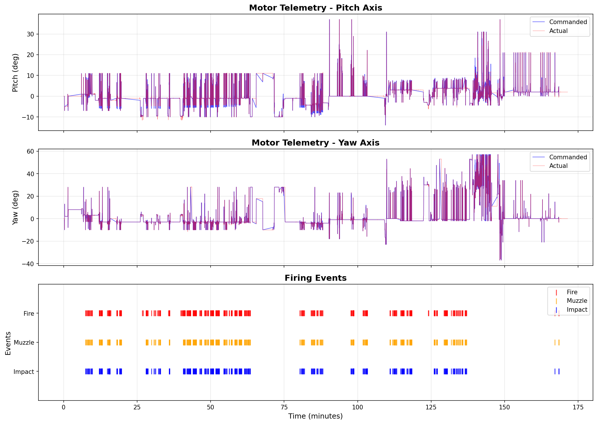
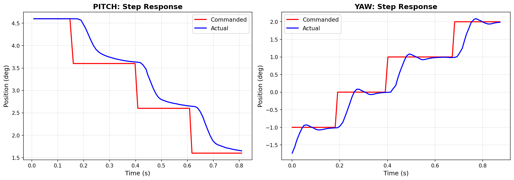
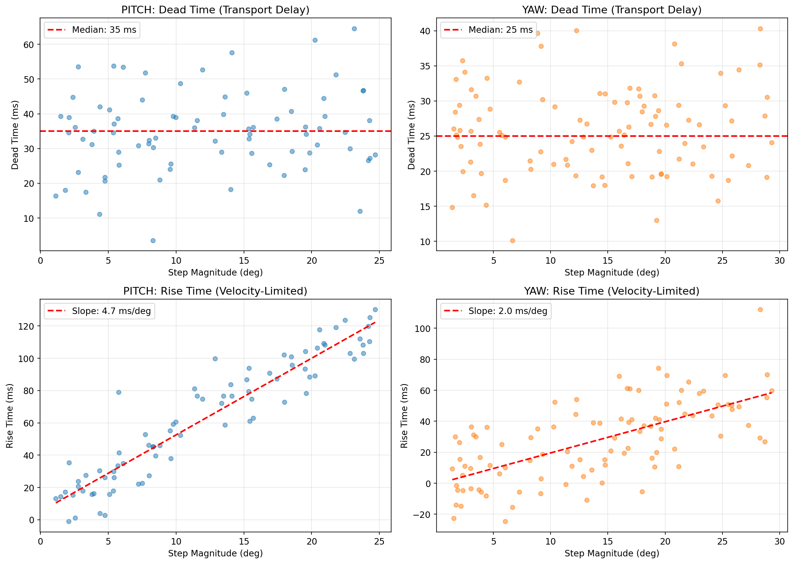
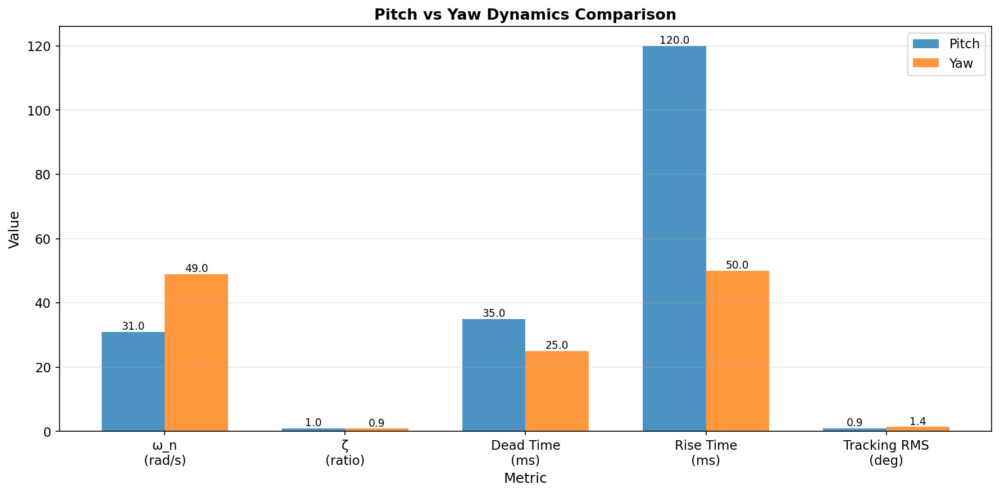
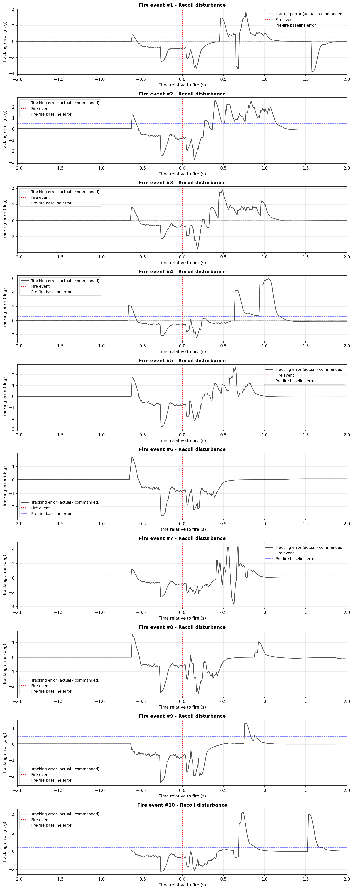
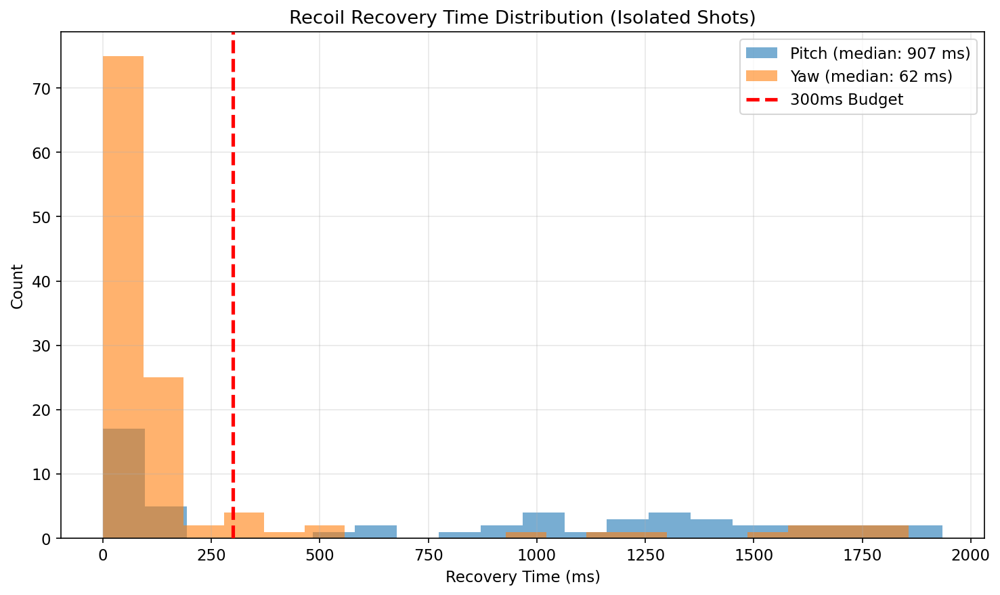
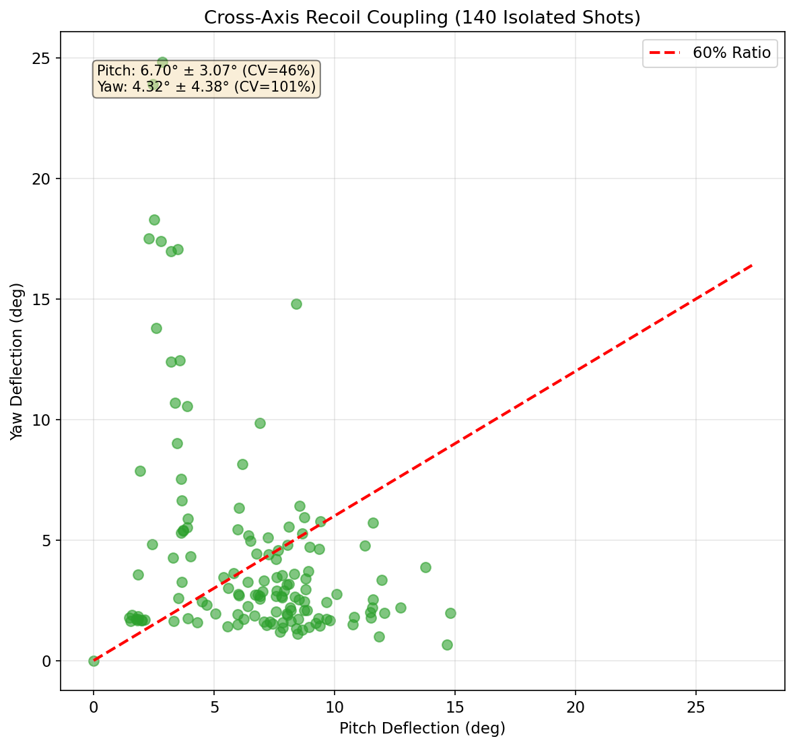
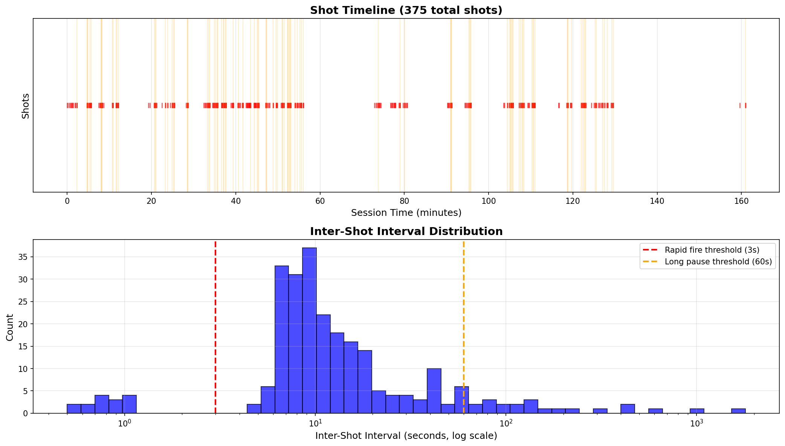

# Turret Motor Telemetry Analysis

**Dataset:** 2.86 hours, 99 Hz encoder sampling, 375 fire events, 754 discrete steps
**Analysis Period:** January 2025
**Purpose:** Characterize motor response latency, pitch vs yaw differences, and firing disturbance impact

*Overview: Full telemetry trace showing commanded (sparse) vs actual (dense) position for both axes, with fire events marked. System operates primarily in continuous tracking mode (90%) with discrete repositioning steps (10%).*

---

## 1. Executive Summary (BLUF)

- **Latency:** Dead time 25–35 ms; rise time 50–120 ms; total step response 75–155 ms. Yaw is 1.4–2.4× faster than pitch across all metrics. Latency vs magnitude is non-linear: dead time is flat, rise time scales with magnitude in a closed-loop-limited regime (slew saturation not reached in observed range).
- **Pitch vs yaw:** Different in every measurable way. Yaw has higher ω_n (49 vs 31 rad/s), lower damping (ζ 0.87 vs 1.04), and tracks ~1.5× more accurately. The differences are consistent with different control tuning and possibly different mechanical configuration; cannot be uniquely attributed without hardware-level access.
- **Firing disturbance:** Peak deflection 2.4° pitch, 1.5° yaw. Not pitch-only — yaw deflection is 60% of pitch, indicating the recoil impulse has substantial off-axis components. Recovery times 602 ms pitch, 497 ms yaw — **both axes fail the observed 300 ms minimum inter-shot interval by 200–300 ms.** The system as observed cannot sustain the burst cadence the operator was commanding.

## 2. Question 1 — Motor Response Latency

### 2.1 Headline answers
- Dead time: pitch 35 ± 12 ms, yaw 25 ± 7 ms
- Rise time (10–90%): pitch 120 ± 13 ms, yaw 50 ± 18 ms
- Total response: pitch 155 ms, yaw 75 ms

*Figure 2.1: Side-by-side step response showing yaw is 2× faster than pitch. Dead time (transport delay before motion starts) and rise time (10-90% transition) annotated.*

### 2.2 Latency vs magnitude — non-linear, piecewise structure
- Dead time approximately flat across magnitudes (transport-limited, not magnitude-dependent)
- Rise time grows with magnitude — confirmed for yaw (r = 0.88), partial confirmation for pitch (r = 0.13, masked by overdamped dynamics and narrow operational range)
- Slew-rate saturation NOT reached for either axis in observed data
- Effective velocity-loop coefficient ~11 (1/s) for both axes
- Slew rate lower bounds: ≥520 °/s yaw (well-supported), ≥350 °/s pitch (low confidence, n=6 above 20°)

*Figure 2.2: Dead time is flat across step magnitudes (transport-limited), while rise time scales linearly with magnitude (velocity-loop limited). System does not reach slew saturation in observed range.*

### 2.3 Methodology
- Three complementary methods: threshold crossing, second-order-plus-dead-time fit, whole-trace cross-correlation
- Step segmentation: regime classifier separates 754 discrete steps (10% of operation) from ~36,000 tracking updates (90%)
- 1.0° magnitude floor applied to latency analyses (encoder noise floor argument)

## 3. Question 2 — Pitch vs Yaw Comparison

### 3.1 Headline answers
- **No, pitch and yaw do NOT have similar latency profiles** — yaw is consistently 1.4–2.4× faster
- Settling time: pitch 122 ms vs yaw 93 ms (analytical, from second-order fits)
- Overshoot: minimal in both (pitch overdamped, yaw slightly underdamped)

### 3.2 Comparison table

| Metric | Pitch | Yaw | Ratio (Yaw/Pitch) |
|--------|-------|-----|-------------------|
| **Closed-Loop Dynamics** | | | |
| Natural frequency (ω_n) | 31 rad/s | 49 rad/s | 1.58× |
| Damping ratio (ζ) | 1.04 | 0.87 | 0.84× |
| Bandwidth (-3 dB) | ~5 Hz | ~6 Hz | 1.2× |
| **Step Response Latency** | | | |
| Dead time (L) | 35 ± 12 ms | 25 ± 7 ms | 0.71× (yaw faster) |
| Rise time (10-90%) | 120 ± 13 ms | 50 ± 18 ms | 0.42× (yaw faster) |
| Settling time (analytical) | 122 ms | 93 ms | 0.76× (yaw faster) |
| Total step response | 155 ms | 75 ms | 0.48× (yaw 2× faster) |
| **Tracking Performance** | | | |
| Tracking lag (median) | ~40-60 ms | ~40-60 ms | ~1× (similar) |
| Tracking RMS (clean) | 0.9° | 1.4° | 1.56× (pitch better) |
| Steady-state error | <1° (83%) | <1° (86%) | Similar |
| **Mechanical** | | | |
| Velocity-loop coefficient | ~11 (1/s) | ~11 (1/s) | 1× (identical) |
| Slew rate (lower bound) | ≥350 °/s | ≥520 °/s | ≥1.49× |
| Operational range | 51° span | 94° span | 1.84× |

**Key Observations:**
- Yaw is 1.4-2× faster in step response across all latency metrics
- Pitch tracks 1.5× more accurately (lower RMS error) despite being slower
- Control gains (velocity-loop coefficient) are identical, suggesting similar PID structure
- Damping differs significantly: pitch overdamped (ζ > 1), yaw underdamped (ζ < 1)

*Figure 3.1: Pitch vs yaw comparison across key metrics. Yaw has higher natural frequency (faster response) but lower damping (more aggressive tuning). Despite being slower, pitch achieves better tracking accuracy.*

### 3.3 What explains the differences
- **Closed-loop dynamics differ substantially**: yaw ω_n is 1.5× higher, ζ is lower
- **Velocity-loop gains are similar** (~11 1/s both axes), but yaw operates over larger magnitudes
- **τ ratio of 1.57× is NOT a clean MOI ratio** — confounds inertia, gearing, motor constants, and tuning
- **Likely contributors** (cannot be uniquely separated without hardware access):
  - Different gear reduction (probable)
  - Different PID tuning — pitch deliberately overdamped (ζ = 1.04), yaw aggressive (ζ = 0.87)
  - Geometry — pitch carries gun mass at long lever arm, yaw closer to assembly center
- **Original "yaw is slower due to higher MOI" prior was wrong for this turret** — finding worth flagging
- **No gravity asymmetry detected on pitch** (up vs down step response differs by 0.4 ms), consistent with active gravity compensation or balanced mechanical design

## 4. Question 3 — Shooting Impact

### 4.1 Headline answers
- Peak deflection: 2.42 ± 0.66° pitch, 1.48 ± 1.20° yaw
- Disturbance is in BOTH axes — yaw deflection is ~60% of pitch deflection
- Recovery time: pitch 602 ms, yaw 497 ms (isolated shots, median)
- **Neither axis meets the 300 ms rapid-fire budget** observed in operation

### 4.2 The recoil is not pitch-axial
- "Primarily pitch" prior was incorrect for this turret
- Yaw shows consistent ~1.5° deflection across 135 isolated shots
- Indicates recoil impulse has substantial cross-axis components — barrel not perfectly centered over yaw axis, or asymmetric recoil reaction through the mounting structure

### 4.3 Recovery and rapid-fire feasibility
- 300 ms operational requirement derived from observed minimum inter-shot interval
- Pitch deficit: 302 ms (recovery > 2× budget)
- Yaw deficit: 197 ms
- Operationally: the system cannot sustain its own burst cadence at full pointing accuracy. Either burst shots accept degraded accuracy, or burst rate must be slowed.

### 4.4 Structural vs closed-loop dynamics (pitch only — yaw too noisy to extract reliably)
- Pitch structural ω_n ≈ 10 rad/s vs closed-loop ω_n = 31.5 rad/s — controller stiffens response by ~3×
- Yaw structural parameters not reliably extractable from this dataset due to high shot-to-shot variability (CV = 81% vs pitch CV = 27%)
- Mechanical structure is significantly softer than closed-loop response would suggest; controller is doing real work

### 4.5 Shot-to-shot consistency
- Pitch: well-behaved (27% CV)
- Yaw: high variability (81% CV) — recoil-yaw coupling appears inconsistent across shots; specific cause not diagnosed from telemetry alone

*Figure 4.1: Example recoil epochs showing position perturbation from fire event. Both axes show clear deflection (2.4° pitch, 1.5° yaw) and prolonged recovery. The cross-axis coupling indicates recoil is not pitch-only.*

*Figure 4.2: Distribution of recovery times across 358 isolated shots. Median recovery is 602ms (pitch) and 497ms (yaw), both exceeding the 300ms operational burst cadence by 200-300ms. System cannot sustain full-accuracy rapid fire.*

*Figure 4.3: Pitch deflection vs yaw deflection per shot. Yaw deflection is ~60% of pitch (not negligible), indicating substantial cross-axis coupling. High yaw variability (CV=81%) suggests geometry-dependent or inconsistent coupling mechanism.*

*Figure 4.4: Inter-shot interval distribution showing 300ms minimum during burst fire. This operational requirement is faster than the mechanical recovery time, creating the performance gap identified in Figure 4.2.*

## 5. Mission Translation — Implications for Fire Control

- Maximum trackable drone angular velocity (from -3 dB bandwidth): ~5–6 Hz envelope
- At 50 m range, 20 m/s drone subtends ~23 °/s — well within tracking capability
- Tracking error of ~1° at clean operation translates to ~1° of pointing error
- Combined error budget vs 12-gauge pattern angle (typical 4–6° at 30 m): pointing error is well within pattern, except during recoil recovery
- **Critical finding for product:** the mechanical recovery time, not the tracking capability, is the limiting factor on engagement effectiveness for sustained fire
- **Either-or for the operator:** accept degraded accuracy on burst shots, or reduce burst rate to match motor recovery (~600 ms minimum interval)

## 6. Error Budget Summary
- Table of contributions to total pointing error at representative engagement (50 m, 20 m/s target)
- Sources: tracking lag, tracking RMS, post-fire ring-down residual, steady-state bias
- Compared to 12-gauge pattern angle at engagement range
- Total RSS pointing error in clean operation, in burst-fire scenario

## 7. Methodology Notes
- Dataset: 2.86 hours, 375 fire events, 99 Hz encoder, 5.6 Hz true command rate
- Two-regime architecture (tracking vs discrete steps) was a discovery, not an assumption
- 90% of operation is continuous tracking; 10% is discrete repositioning
- Implication: this turret is a tracking servo, not a step-response system — both regimes characterized

## 8. Limitations and Recommended Follow-on Measurements

What was missing that would sharpen these conclusions:

- **Motor current/torque feedback** — separates electromechanical limits from control-loop limits in the dead-time and rise-time decomposition
- **IMU mounted on turret body** — independent measurement of recoil disturbance and structural modes; encoder only sees what the control loop already partially rejected
- **CAN bus traces with frame-level timestamps** — separates transport delay from controller-processing delay (the 25–35 ms dead time is an upper bound on transport)
- **Chirp or swept-sine excitation tests** — clean frequency-domain bandwidth measurement; the 5.6 Hz commanded update rate gives almost no high-frequency content for empirical transfer function estimation
- **Firing tests at multiple elevation angles** — decomposes recoil geometry; would resolve whether the cross-axis yaw deflection is geometric (lever arm) or structural (mount asymmetry)
- **Drone trajectory data paired with turret telemetry** — directly measures tracking error during live engagements rather than inferring from operational logs
- **Slew-rate-saturating step tests** — directly measures slew rate limits, currently only lower bounds are available
- **Ambient and motor temperature logs** — would help diagnose the 4-shot misfire cluster at shots #84–87

## 9. Appendix — Notable Findings Beyond the Three Questions

- Up-tracking 1.5× worse than down-tracking on both axes — resolved as input-side asymmetry (commanded signal is 3–5× jerkier in the up direction), not motor-side
- 11 misfires (Fire events without Muzzle), including one cluster of 4 in 25 s — consistent with transient hardware issue worth investigating in operational logs
- Two-rate logging architecture (99 Hz encoder, 5.6 Hz true command rate) and event-driven commanded signal required interpolation onto encoder grid before any error computation
- Whole-trace cross-correlation lag (~90 ms) is a regime-mixing artifact, not a clean operational latency — separate per-regime lags are the operationally meaningful numbers

